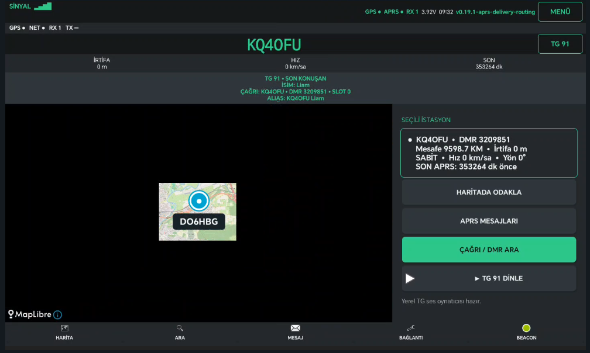
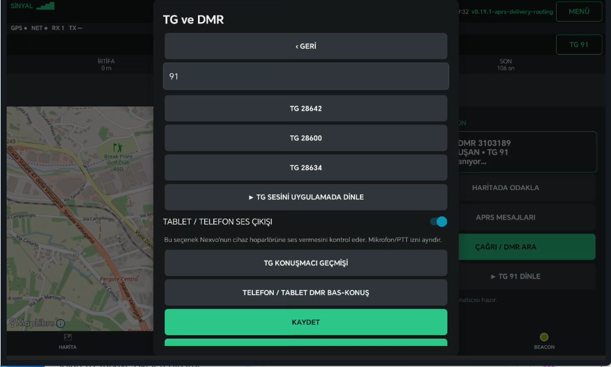
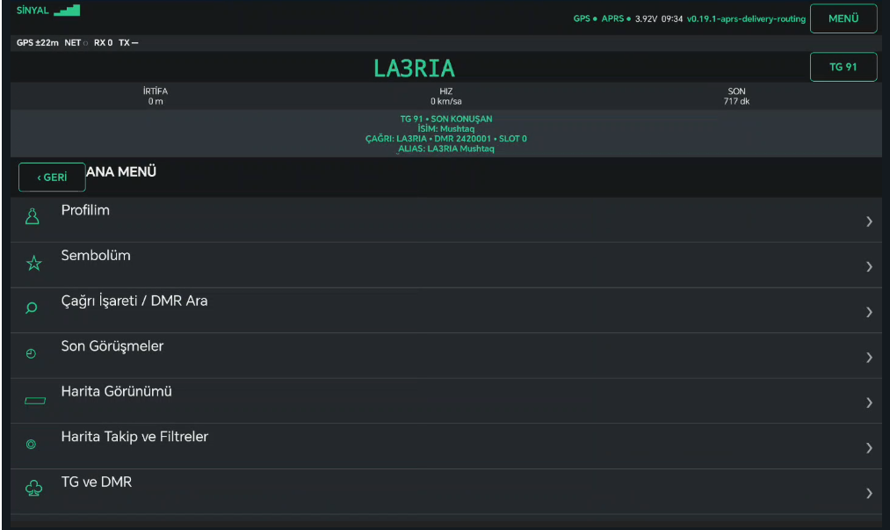
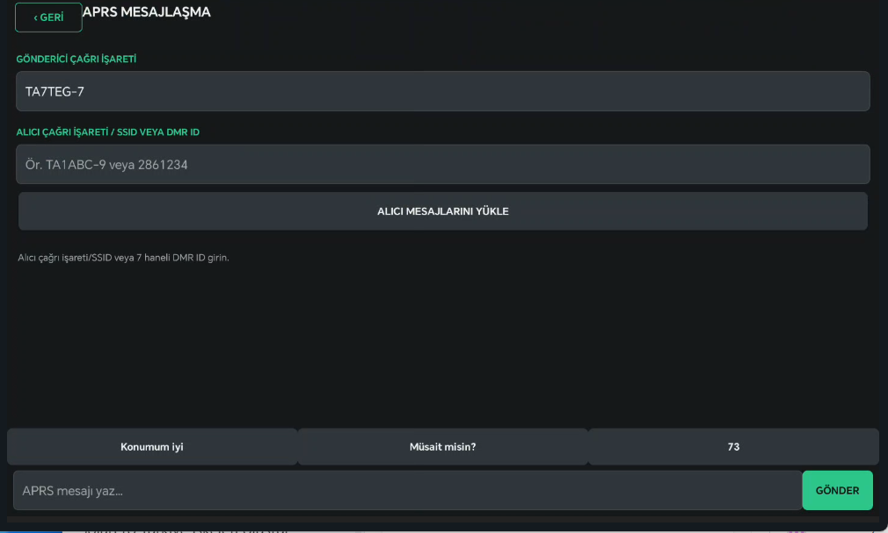

# Nexvo APRS

Nexvo APRS is a non-commercial, open-source Android and server project for amateur radio operators. It aims to provide an accessible APRS station map, messaging, beaconing, telemetry and supporting digital-radio tools in a single application.

The project is led by Yusuf Uzun (`TA7TEG`) in Türkiye and is currently under active development.

## Current capabilities

- APRS-IS station reception and map display
- Callsign search, station focus and station details
- APRS messaging with local history
- Position beacon configuration
- APRS.fi integration using a user-provided API key
- Encrypted local storage for credentials and API keys
- Optional Nexvo server API for queued/offline messages
- Android tablet-oriented interface
- Multilingual user interface support, including Turkish and English

## Screenshots

  
  

  
  

## Planned work

- Improved map stability, marker clustering and filters
- Repeater, weather and emergency-information views
- Background beacon controls and adaptive beaconing
- Community testing and public documentation
- RF TNC, I-Gate and digipeater research with compatible radio hardware

Hardware-dependent RF features are experimental and require lawful amateur-radio operation, compatible audio/PTT hardware and real-device testing.

## Repository structure

- `app/` — Android application
- `server/` — optional PHP/MySQL backend
- `gradle/` — Gradle wrapper files

## Building

1. Install JDK 17 and Android SDK Platform 34.
2. Create `local.properties` with your Android SDK path.
3. Run `./gradlew assembleDebug` on Linux/macOS or `gradlew.bat assembleDebug` on Windows.

API keys, callsigns, APRS-IS passcodes and server tokens are not included. Users must provide their own credentials and comply with the terms of each service.

RepeaterBook integration uses a per-user token and is governed by the concrete request, cache, geographic-scope, backoff, attribution and no-redistribution controls documented in [`docs/REPEATERBOOK_API_POLICY.md`](docs/REPEATERBOOK_API_POLICY.md).

## Project continuity

The roadmap includes public issue tracking, reproducible builds, contributor documentation and community testing. Contributions from amateur-radio operators, Android developers, mapping specialists, translators and accessibility testers are welcome.

## License

Licensed under the MIT License. See [LICENSE](LICENSE).
