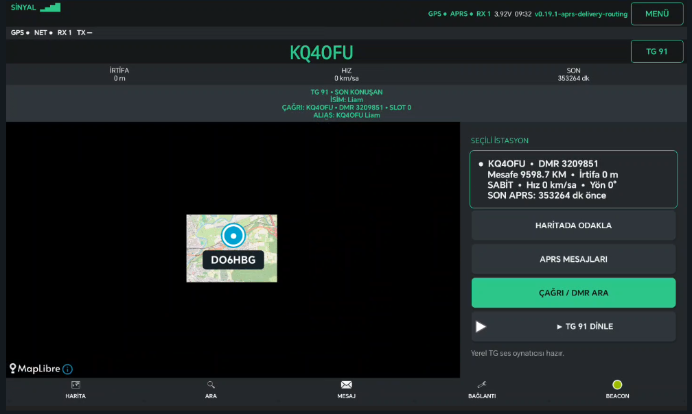
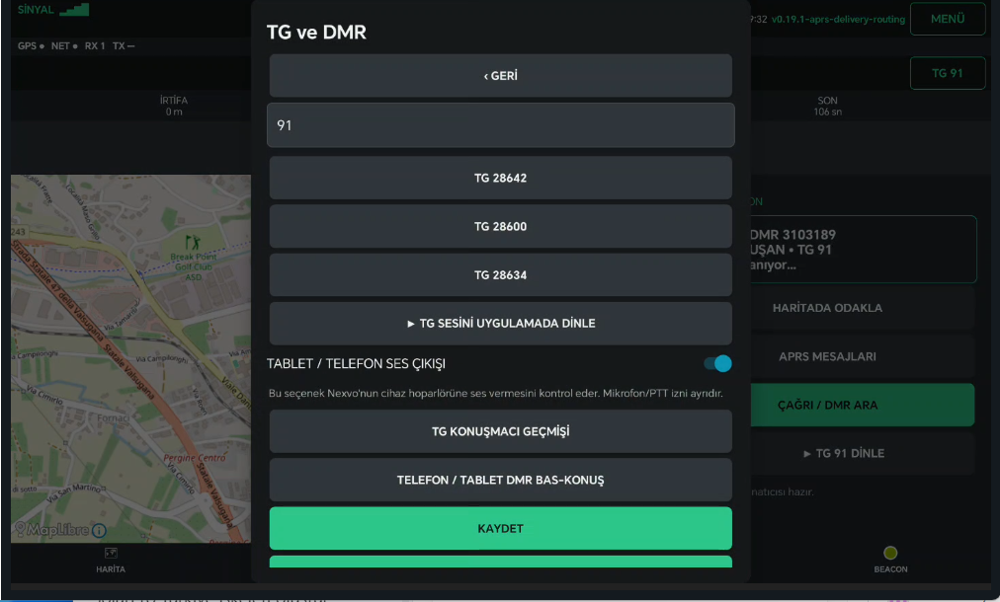
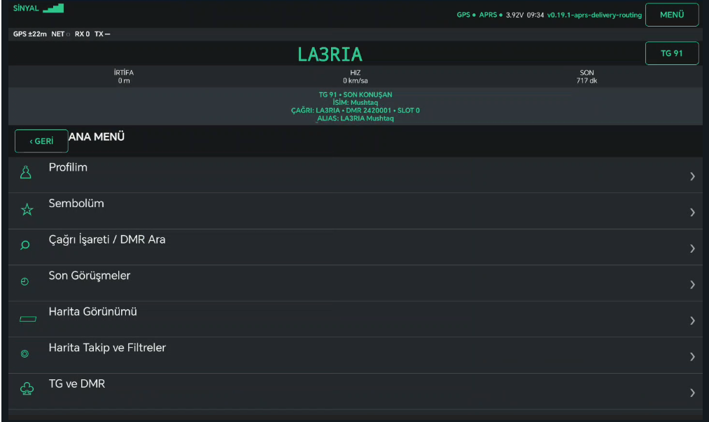
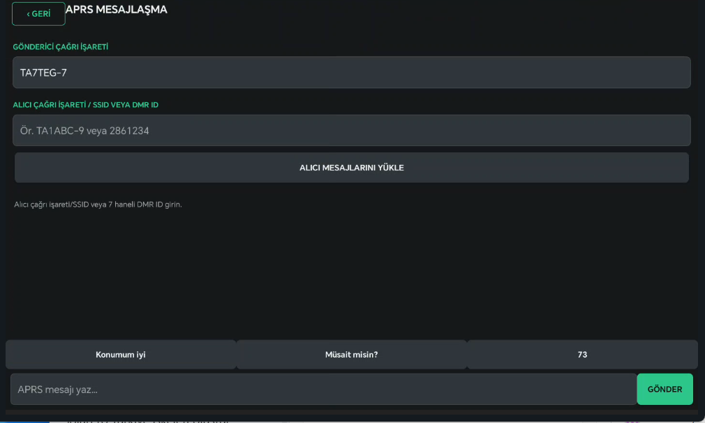

# Nexvo APRS

Nexvo APRS is a non-commercial, open-source Android and server project for amateur radio operators. It brings accessible APRS station mapping, messaging, beaconing, telemetry, and supporting digital-radio tools together in one application.

The project is led by Yusuf Uzun (`TA7TEG`) in Türkiye and is under active development. The current Android application supports phones and tablets. Its interface is multilingual: Turkish and English are available today, and the project is designed for community-driven language expansion worldwide.

## Current capabilities

- APRS-IS station reception and map display
- Callsign search, station focus and station details
- APRS messaging with local history
- Position beacon configuration
- APRS.fi integration using a user-provided API key
- Encrypted local storage for credentials and API keys
- Optional Nexvo server API for queued/offline messages
- Android phone and tablet interface
- Multilingual interface, currently Turkish and English, designed for global community translation

## Working Android test build

Nexvo APRS is more than a concept: a working Android test APK has been installed and exercised on physical Android phone and tablet hardware during development. The screenshots below are taken from the running application.

A public GitHub Release is not yet published. Before the next public test distribution, the project will publish the APK version name and code, the corresponding commit, installation and test instructions, known limitations, and a clear feedback route for volunteers.

## Screenshots

## Public testing and validation roadmap

The next stage is a documented public test programme for Android phones and tablets. It will validate installation and startup, location permission and on-device GNSS behaviour, APRS-IS map and station display, messaging and local history, beacon settings, accessibility, multilingual interface quality, and error reporting.

Testing will be carried out with volunteer amateur-radio operators and Android users on a range of phone and tablet hardware. Each test package will include a versioned APK, install steps, a short scenario checklist, known limitations, and a structured feedback path. Personal credentials, API keys and precise location history must never be included in public bug reports.

Success criteria for a public test release include repeatable installation, core APRS functions completing on supported devices, clear reproduction notes for defects, and a published response or next-step status for reported issues.

## Planned work

- Improved map stability, marker clustering, and filters
- Repeater, weather, and emergency-information views
- Background beacon controls and adaptive beaconing
- Community testing, release notes, and public documentation
- Community-driven translations and global accessibility improvements
- RF TNC, I-Gate, and digipeater research with compatible radio hardware
- Foundation work for future iOS, macOS, and Windows releases
- macOS-based build, testing, signing, and release workflow for planned Apple-platform applications
- Disaster and emergency resilience research using on-device GNSS location
- Morse/CW learning and compatible-device preparation

## Morse/CW learning and compatible-device preparation

Nexvo APRS is preparing a practical Morse/CW assistant that converts ordinary letters and numerals to International Morse Code. The first public scope is an accessible preview and practice interface with a reusable encoder, helping users learn and verify Morse representations.

The project also defines a future transport-adapter boundary for compatible radio or accessory devices. This preparation does not mean that a phone independently transmits RF or satellite traffic. Any transmission requires compatible equipment, a supported network or lawful amateur-radio path, and the appropriate operator authorization.

With the user's permission, Nexvo APRS will use the device's built-in GNSS receiver to obtain and display location coordinates when cellular service is unavailable, subject to satellite visibility and device capability. Sending an emergency message without a cellular network requires compatible satellite or radio hardware and lawful operation.

Hardware-dependent RF features are experimental and require lawful amateur-radio operation, compatible audio/PTT hardware, and real-device testing.

## Project updates and transparent funding

Nexvo APRS is community-led, free, and open source. Project progress, goals, and financial activity are shared through Open Collective.

- [Open Collective page](https://opencollective.com/nexvo-aprs)
- [Support the project](https://opencollective.com/nexvo-aprs/contribute)
